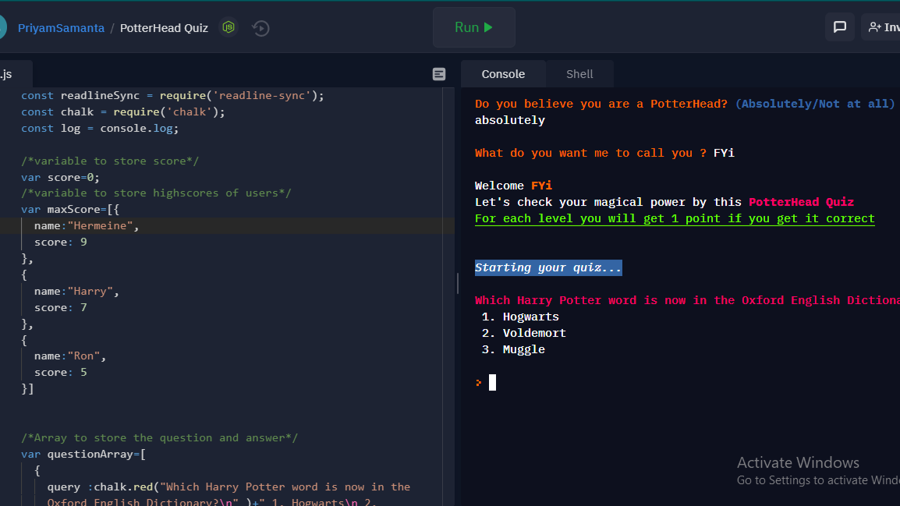

<h1 align="center" >Potterhead CLI Quiz</h1>
<p align="center">
  <a href="https://github.com/dipsam/PotterHead_Quiz">
    
  </a>
</p>

<p align="center">A simple CLI quiz to check your knowledge about Harry Potter stuffs</p>

<h1 align="center">Links</h1>

<p align="center">
    <a href="https://replit.com/@PriyamSamanta/PotterHead-Quiz#index.js?embed=1&output=1"><strong>View Demo >></strong></a>
    
</p>

### About the Project



### Built With

This section should list any major frameworks that you built your project using. Leave any add-ons/plugins for the acknowledgements section. Here are a few examples.

- [CHALK](https://www.npmjs.com/package/chalk)
- [readline-sync](https://www.npmjs.com/package/readline-sync)
- [JavaScript](https://developer.mozilla.org/en-US/docs/Web/JavaScript)
- [Node JS](https://nodejs.org/en/)

### Prerequisite for running on local

- [Nodejs & Npm](https://nodejs.org/en/) Installed
  <br></br>

### Installation Steps

1. Clone the repository

```Bash
git clone https://github.com/dipsam/PotterHead_Quiz.git
```

2. Change the working directory

```Bash
cd PotterHead_Quiz/src
```

3. Run the app using your terminal

```Bash
node index.js
```
